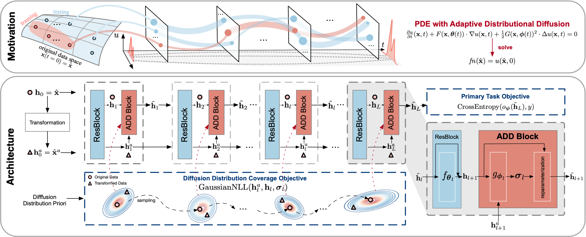

# PDE+: Enhancing Generalization via PDE with Adaptive Distributional Diffusion

> Yige Yuan, Bingbing Xu, Bo Lin, Liang Hou, Fei Sun, Huawei Shen, Xueqi Cheng
> 
> The 38th Annual AAAI Conference on Artificial Intelligence (AAAI), 2024

This is an official PyTorch implementation of paper [PDE+: Enhancing Generalization via PDE with Adaptive Distributional Diffusion](https://arxiv.org/pdf/2305.15835.pdf).




## Training & Testing

All arguments are located in the parse.py file. You can create a script to specify the parameters.

For example, you can run our PDE+ by using the following command:
```
bash ./scripts/train/pdeadd_cifar10.sh 
```
Or you can run the basic ERM by using the command:
```
bash ./scripts/train/std_cifar10.sh 
```

## Reference

If you find our work useful, please consider citing our paper:
```
@article{yuan2023pde+,
  title={PDE+: Enhancing Generalization via PDE with Adaptive Distributional Diffusion},
  author={Yuan, Yige and Xu, Bingbing and Lin, Bo and Hou, Liang and Sun, Fei and Shen, Huawei and Cheng, Xueqi},
  journal={arXiv preprint arXiv:2305.15835},
  year={2023}
}
```